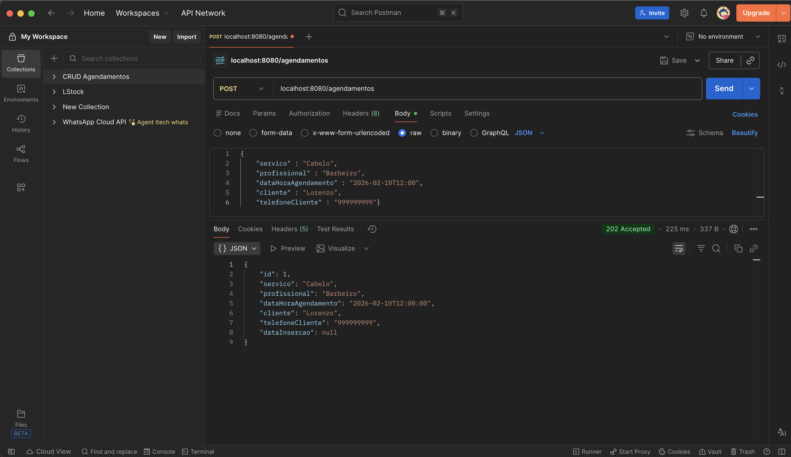
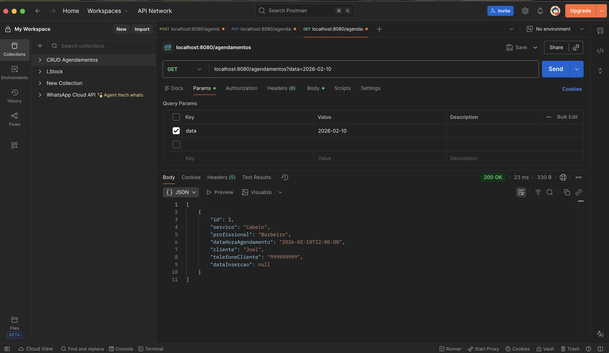
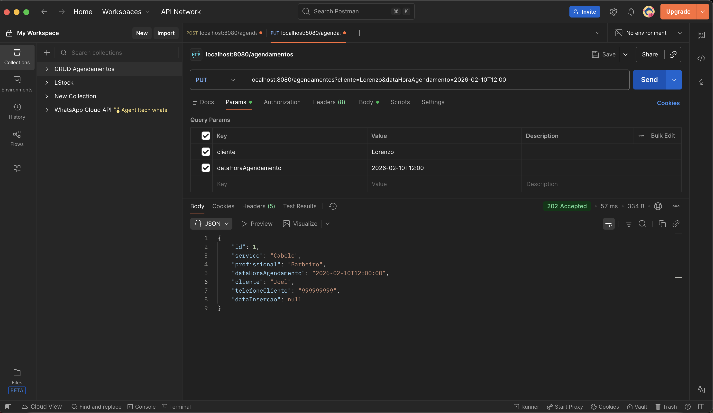
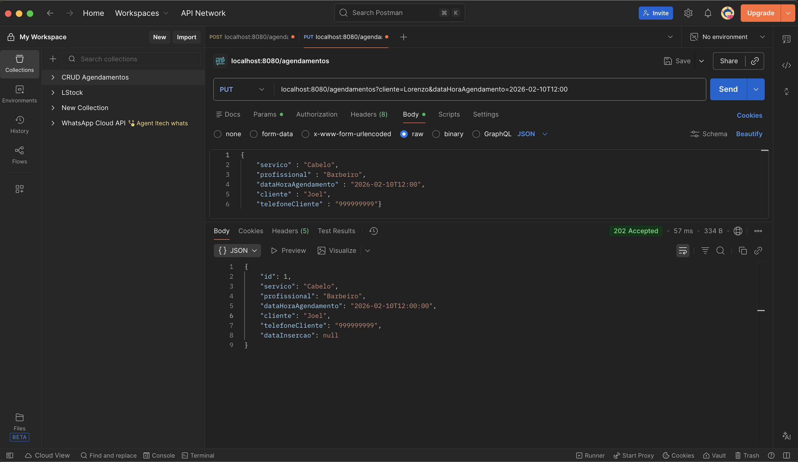
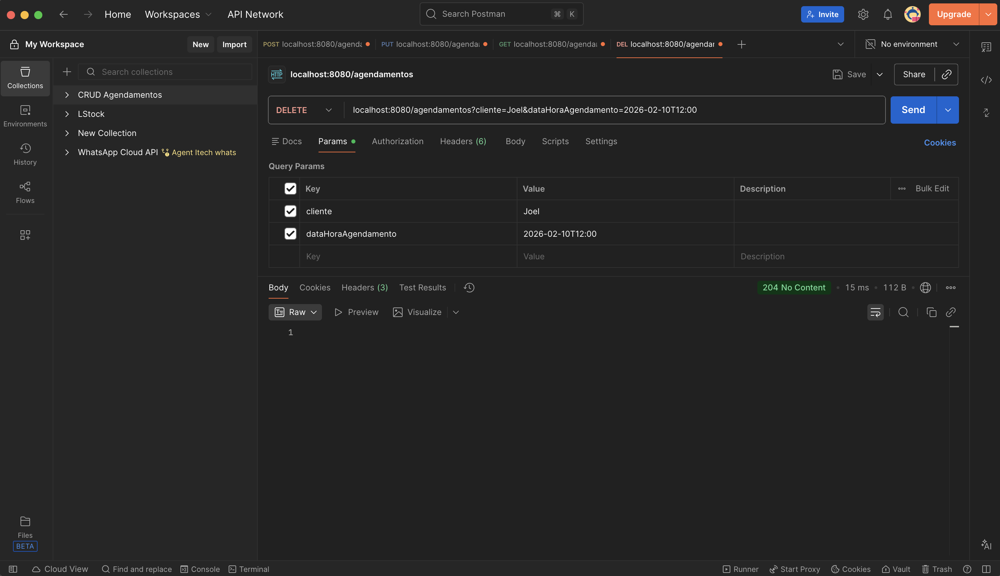
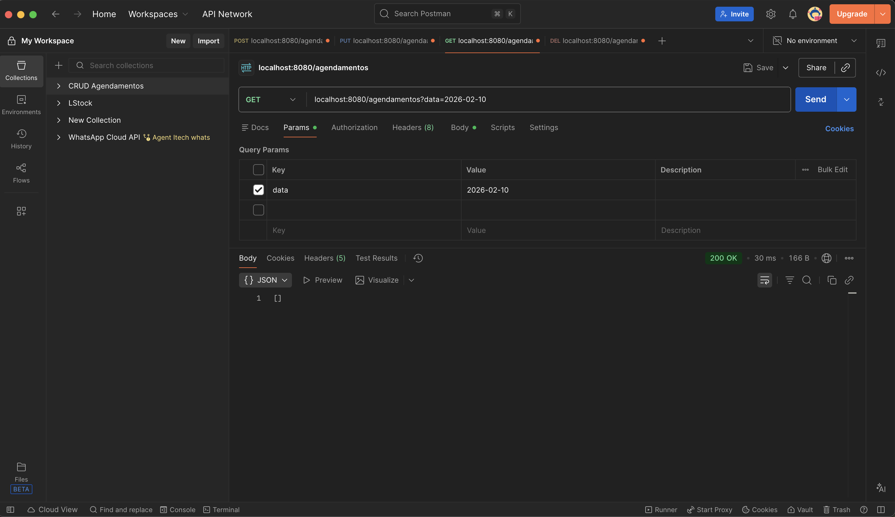
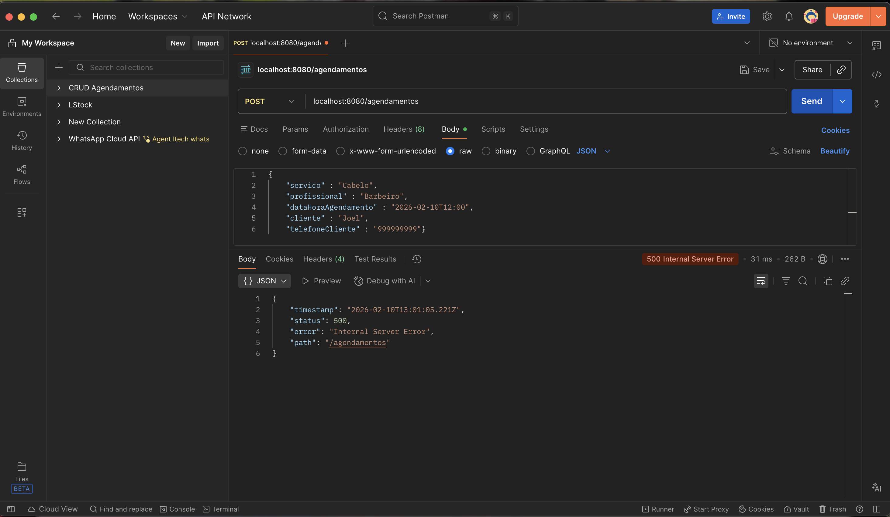
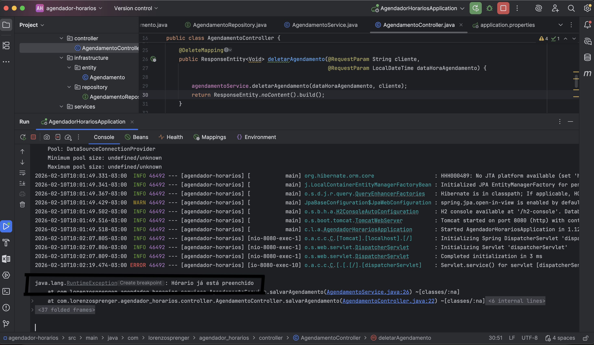

# Agendador de Horários - API REST

Este projeto consiste em uma API REST desenvolvida com Spring Boot para gerenciar agendamentos de serviços. O objetivo principal foi criar um sistema robusto que impeça conflitos de horários, garantindo a integridade da agenda.

O sistema foi modelado pensando em cenários reais (como barbearias ou consultórios), onde a regra de negócio exige validação de disponibilidade antes de confirmar qualquer registro.

## Tecnologias Utilizadas

* **Java 21**
* **Spring Boot** 
* **Spring Data JPA** 
* **H2 Database** 
* **Lombok** 

## Arquitetura e Organização

O projeto segue a arquitetura em camadas padrão do Spring para manter a separação de responsabilidades:

1.  **Controller:** Responsável por expor os endpoints e lidar com as requisições HTTP.
2.  **Service:** Contém a lógica de negócios (validações de horário, regras de atualização).
3.  **Repository:** Interface de comunicação direta com o banco de dados.
4.  **Entity:** Representação da tabela `Agendamento` no banco de dados.

## Regras de Negócio Implementadas

* **Conflito de Horário:** O sistema não permite dois agendamentos no mesmo intervalo de tempo.
* **Duração do Serviço:** Foi padronizado que cada agendamento ocupa 1 hora.
* **Busca por Dia:** A listagem filtra todos os agendamentos compreendidos entre 00:00 e 23:59 da data informada.
* **Identificação Única:** Para deletar ou atualizar, é necessário validar o cliente e o horário original.

---

## Documentação da API

Abaixo, o detalhamento de como consumir cada endpoint testado via Postman.

### 1. Criar Agendamento (POST)
**Endpoint:** `/agendamentos`

Recebe os dados do agendamento no corpo da requisição. A data de inserção é gerada automaticamente pelo sistema.

### 2. Listar Agendamentos (GET)
**Endpoint:** `/agendamentos`

Utiliza um parâmetro de consulta (`data`) para filtrar a agenda do dia específico.

Exemplo: `?data=2026-02-10`

### 3. Atualizar Agendamento (PUT)
**Endpoint:** `/agendamentos`

A atualização exige duas etapas na mesma requisição para garantir que estamos alterando o registro correto:

1.  **Query Params:** Identificam o registro original (quem é o cliente e qual era o horário antigo).
    

2.  **Body:** Contém os novos dados que substituirão os antigos.
    

### 4. Deletar Agendamento (DELETE)
**Endpoint:** `/agendamentos`

Remove um agendamento baseando-se na combinação de cliente e horário.

**Verificação:**
Ao realizar uma nova busca (GET) após a deleção, a lista retorna vazia ou sem o item excluído, confirmando a operação.

---

## Tratamento de Erros e Exceções

Uma das principais funcionalidades é a validação de disponibilidade. Caso tente-se agendar um horário que colida com um já existente (intervalo de 1 hora), o sistema bloqueia a operação.

**Resposta da API (Postman):**
Retorna um erro 500 indicando falha interna devido à regra de negócio.

**Log da Aplicação:**
No console, é possível ver a `RuntimeException` sendo lançada com a mensagem personalizada "Horário já está preenchido", impedindo a gravação no banco.

